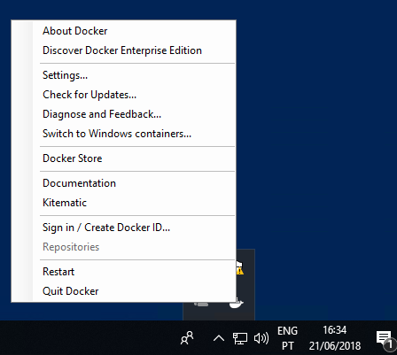
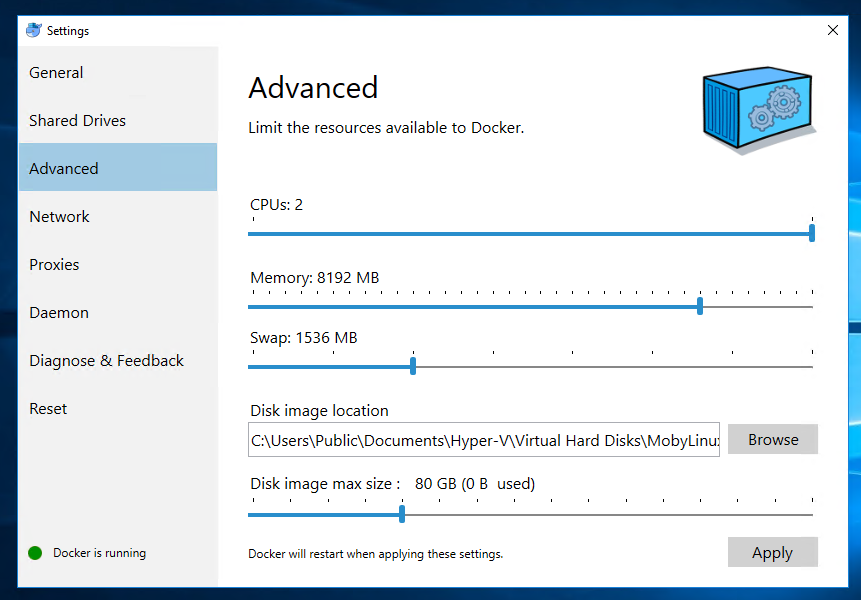
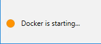
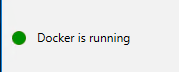

# Coral Docker Distribution Configuration in Windows

This page contains the information on how to configure Docker in order to have a working environment to run the distribution on Windows.

The described steps should be performed after having installed Docker but before running the deployment command.

To access the Docker configuration screen, go to the taskbar, right-click the whale (:whale:) icon and select `Settings` (see image below).

A window for Docker configuration will appear (see image below). Click on the `Advanced` tab on the left and configure the bars to have the values represented in the image. To apply the new settings, click on `Apply`.  

When the new settings are applied, the window will block any user interaction. Click `Yes` if Docker asks for permission to enable the containers feature.  
You must wait while Docker restarts to apply the changes. During this time, you should see a status color warning and message like the one below.  

Eventually, Docker will become available with the new configured settings. It is possible to confirm that by checking if the previously mentioned status:

You should now be able to proceed with the deployment. Return to the [README](../README.md#deployment) file to follow the instructions. 
